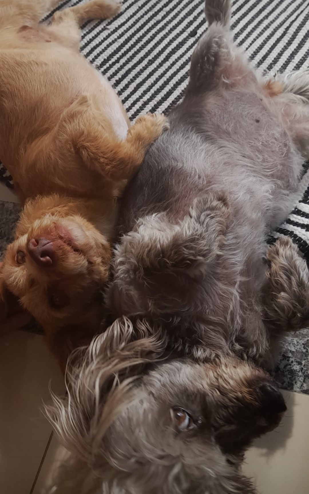
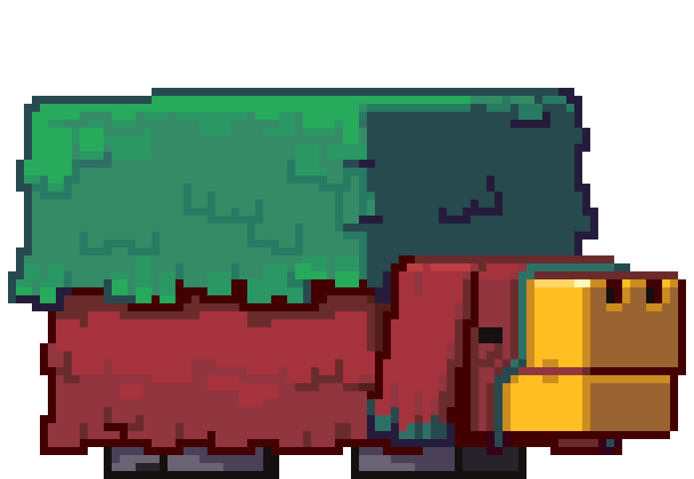

  
<pre>
    💼 ADS @ FMP • Back-end dev • Analista de sistemas
    💻 RESTful API • WebScraping • Automation
    📖 Clean Architecture • Multi-tenant • Microservices
    🎮 Music • Games • Code • Art
    🐕 Lola & Lolita 
</pre>
 

  

  

  

### 💻 Linguagens

### ⚙️ Frameworks & Bibliotecas

 

### 🗄️ Bancos de Dados

### 🛠️ Ferramentas

### 📚 Atualmente Estudando

### 💼 Apresentação Profissional

Sou desenvolvedor back-end e estudante de Análise e Desenvolvimento de Sistemas na Faculdade Municipal de Palhoça. 
Gosto principalmente de trabalhar com automação, Web Scraping e desenvolvimento de APIs.

Atualmente faço estágio na Câmara Municipal de São José, onde participo do desenvolvimento de automações e ferramentas que facilitam processos cotidianos/repetitivos.

Estou sempre buscando aprender coisas novas e me aprofundar em temas que despertam meu interesse, não apenas na área de programação.
Tenho interesse em oportunidades em empresas e startups onde eu possa crescer profissionalmente e contribuir para a evolução dos projetos.

